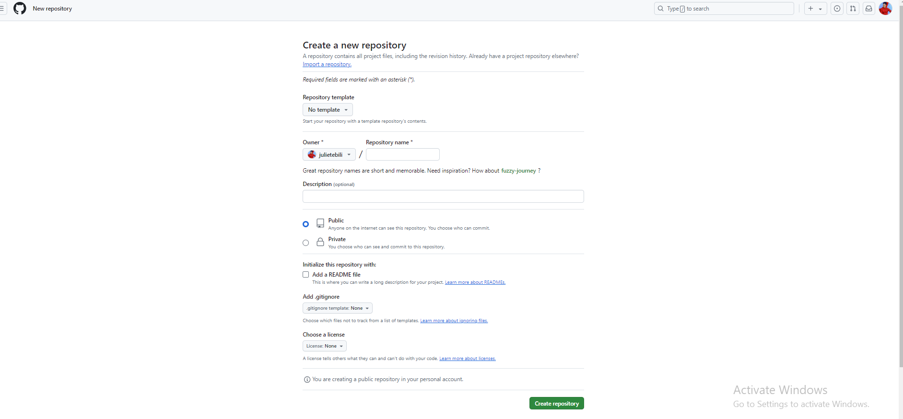
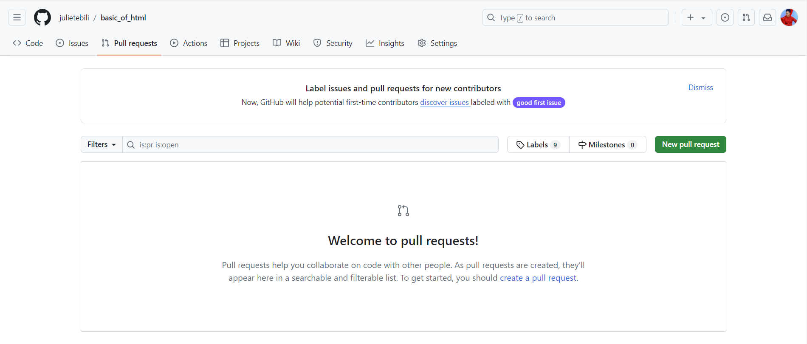
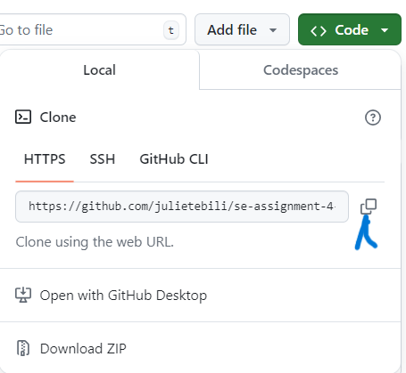

# SE-Assignment-4
Assignment: GitHub and Visual Studio
Instructions:
Answer the following questions based on your understanding of GitHub and Visual Studio. Provide detailed explanations and examples where appropriate.

Questions:
Introduction to GitHub:

What is GitHub, and what are its primary functions and features? Explain how it supports collaborative software development.
Repositories on GitHub:

ANSWER:
GitHub is a web-based platform for version control and collaboration in software development. It allows developers to host their code repositories, track changes, manage projects, and collaborate with others.

Primary Functions and Features:

Version Control: GitHub uses the Git version control system, enabling developers to create, merge, and track changes to codebase.
Code Hosting: Provides a centralized repository for storing and managing code projects.

Collaboration: Facilitates collaboration between multiple developers on the same project, allowing them to work together on branches, resolve conflicts, and share ideas.

Issue Tracking: Allows teams to create and manage issues, track bugs, feature requests, and other development tasks.
Pull Requests: Enables developers to propose changes to a project and collaborate with the maintainer to review, discuss, and merge their contributions.

Project Management: Provides tools for organizing and managing projects, such as kanban boards, wikis, and discussion forums.

How it Supports Collaborative Software Development:

GitHub supports collaborative software development through several key features:

Centralized Repository: Provides a single location for developers to access, share, and work on codebase.

Version Control: Allows multiple developers to work on different parts of a project simultaneously without overwriting each other's changes.

Branching and Merging: Enables developers to create new branches for experimental or feature development, then merge them back into the main codebase when ready.

Pull Requests: Provides a formal way for developers to propose changes, receive feedback, and discuss code before it is merged.
Code Reviews: Allows collaborators to review and comment on proposed changes, ensuring code quality and compliance with project standards.
Repositories on GitHub:

Repositories are the core of GitHub. Each repository represents a project or codebase and contains all the code, history, and metadata associated with it. Repositories can be public (accessible to everyone) or private (only accessible to collaborators). Developers can create multiple repositories for different projects or sub-projects.

What is a GitHub repository? Describe how to create a new repository and the essential elements that should be included in it.
Version Control with Git:

ANSWER:
A GitHub repository, often referred to as a "repo," is a central storage space for code, documentation, issues, and other project-related assets used in software development. It allows multiple collaborators to work together on the same project and track changes over time through version control.

How to Create a New Repository

To create a new GitHub repository:

Go to your GitHub account and click on the "New" button.
Select "Repository" from the dropdown menu.
Enter a name for your repository and a brief description.
Choose whether to initialize the repository with a README file and license.
Click on the "Create repository" button.

Essential Elements of a GitHub Repository

A well-structured GitHub repository should include the following essential elements:

README file: This file provides an overview of the project, its purpose, usage instructions, and any other relevant information.

LICENSE file: This file specifies the terms under which the code can be redistributed and modified.

.gitignore file: This file contains a list of files or patterns that should be ignored by version control, such as temporary or generated files.

Code: The actual source code files for the project.

Documentation: Additional documentation, such as tutorials, guides, and design documents.

Issues: A tracker for bugs, feature requests, and other issues related to the project.

Pull Requests: A mechanism for submitting proposed changes to the codebase for review and merging.

Contributors: A list of individuals who have contributed to the project.

Version Control with Git

Git is a distributed version control system used with GitHub. It allows developers to track changes to files over time, creating a history of the project's development. Essential Git commands include:

git init
: Initializes a local Git repository.

git add
: Adds files to be tracked by Git.

git commit
: Creates a snapshot of the changes and saves them to a local Git database.

git push
: Pushes the local changes to a remote repository on GitHub.

git pull
: Retrieves changes from the remote repository and merges them with the local copy.

git checkout
: Switches between different branches or versions of the code.

Explain the concept of version control in the context of Git. How does GitHub enhance version control for developers?
Branching and Merging in GitHub:

ANSWER:

Version Control with Git

Version control is a way to track and manage changes to files over time. Git is a popular distributed version control system that allows developers to collaborate effectively and maintain a clear history of changes.

In Git, a repository is a collection of files that are tracked by the system. Developers can make changes to files in the repository and track those changes as "commits." Each commit creates a snapshot of the repository at that point in time.

GitHub Enhancements for Version Control

GitHub is a web-based platform that provides a user-friendly interface for working with Git repositories. It enhances version control for developers by offering the following features:

Centralized Repository: GitHub provides a centralized location for hosting Git repositories. This makes it easy for multiple developers to collaborate on the same codebase.

Collaboration Tools: GitHub offers tools for collaboration such as pull requests, issue trackers, and code reviews. These tools facilitate communication between developers and ensure that code changes are thoroughly reviewed before being merged into the main branch.

Branching and Merging: GitHub provides a graphical interface for creating and merging branches. Branches allow developers to work on different versions of the code without affecting the main branch. Merging allows developers to combine changes from different branches into a single codebase.

Pull Request System: GitHub's pull request system allows developers to request that their changes be merged into the main branch. Other developers can review and discuss the proposed changes before approving them. This process ensures that code changes are thoroughly vetted before being integrated.

Branching and Merging in GitHub

Branching creates a copy of a repository at a specific point in time. This allows developers to experiment with changes without affecting the main branch. Merging combines changes from different branches back into the main branch.

Steps to create and merge a branch in GitHub:

Create a new branch from the main branch.
Make changes and commit them to the newly created branch.
Create a pull request to request that your changes be merged into the main branch.
Assign reviewers and request feedback.
Address any comments or suggestions and update the branch accordingly.
Merge the branch into the main branch.
Branching and merging allow developers to work independently, isolate changes, and collaborate efficiently on large codebases. GitHub's graphical interface and pull request system make this process seamless and effective.

What are branches in GitHub, and why are they important? Describe the process of creating a branch, making changes, and merging it back into the main branch.
Pull Requests and Code Reviews:

ANSWER:

Branches in GitHub

Definition: Branches in GitHub are copies of a repository's codebase that allow developers to work on and test different changes independently without affecting the main branch.

Importance: Branches are crucial for software development because they:

Provide isolation for experimental changes, preventing them from disrupting the main codebase.
Allow multiple developers to work on different features simultaneously without conflicting with each other.
Promote collaboration by enabling peer code reviews and feedback before merging changes into the main branch.

Creating a Branch
-   Navigate to your repository on GitHub.
-   Click the "Branch: main" dropdown menu in the top-right corner.
-   Enter a name for your new branch and click "Create branch."
-   Making Changes and Committing
-   Make desired changes to the code in your new branch.
-   Stage the modified files using
-   git add .
-   Commit your changes with a meaningful commit message using
    git commit -m "My commit message"

Merging Back into Main

Merge Request:

Once your changes are ready to be merged into the main branch, create a merge request (also known as a pull request) through the following steps:

Navigate to your repository's Pull Requests tab.
-   Click "New pull request."
-   Select the source and target branches (your new branch as source, main as target).
-   Enter a title and description for your merge request.

Code Review:

Code reviews are essential for ensuring code quality and collaboration. Encourage other team members to review your changes and provide feedback:

Share the merge request with reviewers.
Discuss and address any comments or suggestions.
Make necessary adjustments to your code.

Merging:
Once the code review is complete and your changes are approved, you can merge the branch into the main branch:

Click the "Merge pull request" button on the Pull Request page.

Confirm that you want to merge the changes.

Your changes will now be integrated into the main branch, and the new branch can be deleted.

What is a pull request in GitHub, and how does it facilitate code reviews and collaboration? Outline the steps to create and review a pull request.
GitHub Actions:

ANSWER:
Pull Requests in GitHub
A pull request (PR) in GitHub is a mechanism for requesting changes to a codebase. It allows contributors to propose modifications and get feedback from collaborators before they are merged into the main code branch.

Facilitating Code Reviews and Collaboration
Pull requests provide a structured workflow for code reviews and collaboration:

Transparency: PRs are publicly visible, allowing team members to track and review changes.

Version Control: PRs represent a change to a specific version of the code, making it easy to revert or merge changes.

Feedback and Discussions: Comments on PRs facilitate discussions, requests for clarification, and feedback on code quality.

Collaborative Editing: PRs allow multiple contributors to work on the same changes simultaneously.

Automated Testing: GitHub Actions can perform automated tests and provide feedback on PRs before they are merged.

Steps to Create and Review a Pull Request
Creating a Pull Request

Create a fork: Create a copy of the repository you want to contribute to.

Make changes: Clone your fork, make your changes, and commit them.

Push commits: Push your changes to your fork.

Create a PR: Visit your fork on GitHub and click "New pull request."

Choose branches: Select your fork's branch and the target branch in the main repository.

Describe changes: Provide a descriptive title and body for the PR, explaining the purpose and scope of the changes.

Request review: Assign reviewers and request their feedback.

Reviewing a Pull Request
Review code: Examine the changes in the PR and assess their quality, clarity, and adherence to coding standards.
Provide feedback: Comment on the PR, asking questions, suggesting improvements, or requesting additional tests.
Approve or decline: Based on your review, approve the PR if it meets the required standards, or decline it if it requires further work.
Discuss changes: If necessary, engage in discussions with the contributor to address concerns or suggest alternative solutions.
Merge changes: Once the PR is approved, it can be merged into the main branch, incorporating the proposed changes into the codebase.

GitHub Actions
GitHub Actions are automated workflows that can be triggered when a pull request is created, updated, or merged. They provide the following benefits for code reviews:

Automated testing: Actions can run tests on PRs to ensure code quality and prevent errors from being merged.
Code quality checks: Actions can analyze code for style issues, code complexity, and adherence to best practices.
Continuous integration: Actions can automatically build and deploy code, providing a real-time view of the PR's impact on the application.

Explain what GitHub Actions are and how they can be used to automate workflows. Provide an example of a simple CI/CD pipeline using GitHub Actions.
Introduction to Visual Studio:

ANSWER:
What are GitHub Actions?

GitHub Actions are tasks that can be automated to run in response to events that occur in your GitHub repository. They enable developers to create custom workflows that automate various tasks in the software development process, such as building, testing, and deploying applications.

How GitHub Actions Can Automate Workflows:

GitHub Actions provides a range of workflow features that allow for automation of tasks:

Events: Actions can be triggered by specific events in the repository, such as pushing commits, creating pull requests, or releasing tags.

Jobs: Jobs are a collection of steps that perform specific tasks within a workflow.

Steps: Actions are organized into steps within a job. Each step can execute a specific command or script.

Actions: Reusable building blocks that provide functionality for specific tasks, such as code checking, dependency management, or deployment.

Example of a Simple CI/CD Pipeline Using GitHub Actions:

A common use case for GitHub Actions is to create a simple CI/CD pipeline. Here's an example:

Workflow Name: CI/CD

On: Push

Jobs:

Build:

Step 1: Checkout the code
Step 2: Install dependencies
Step 3: Build the application
Test:

Step 1: Run unit tests
Deploy:

Step 1: Deploy the application to a staging environment
Example Action:

The following example action checks the code quality using the CodeQL analysis:

- name: CodeQL Analysis
  uses: github/codeql-action/analyze@v1

Benefits of Using GitHub Actions:

Automation: Automates repetitive tasks and frees up development time.
Customization: Allows for tailor-made workflows to meet specific needs.
Flexibility: Supports various languages, frameworks, and tools.
Collaboration: Enables team members to collaborate on workflow creation.
Integration: Integrates with other GitHub features and third-party tools.

What is Visual Studio, and what are its key features? How does it differ from Visual Studio Code?
Integrating GitHub with Visual Studio:

ANSWER:

Visual Studio

Visual Studio is an integrated development environment (IDE) created by Microsoft for developing modern applications across multiple platforms, including Windows, macOS, Linux, iOS, and Android.

Key Features:

-   Cross-Platform Development: Supports developing apps for various platforms with native UI and functionality.
-   Code Editing: Advanced text editor with IntelliSense (code completion), refactoring, and debugging tools.
-   Debugging and Profiling: Powerful debugger and profiling tools for identifying and resolving code issues.
-   Team Collaboration: Features like version control (Git integration) and code reviews for seamless team development.
-   Extensibility: Allows for customization and extension through a vast marketplace of plugins.

Visual Studio Code (VS Code)

Visual Studio Code is a free and open-source code editor also developed by Microsoft. It provides a lightweight and customizable development environment.

Key Features:

-   Lightweight and Fast: Small footprint and quick startup time, making it suitable for smaller projects.
-   Cross-Platform Support: Runs on Windows, macOS, and Linux.
-   Extensibility: Extensive marketplace of plugins for language support, code analysis, and more.
-   Debugging and IntelliSense: Supports debugging and code completion for various languages.
-   Collaboration Features: Basic Git integration and support for remote development.

Differences between Visual Studio and VS Code:

Target Audience: Visual Studio is aimed at professional developers working on large-scale projects, while VS Code is designed for individual developers or smaller teams.

Feature Set: Visual Studio offers a more comprehensive set of features, including debugging, profiling, and team collaboration tools, while VS Code focuses on providing a customizable and lightweight coding environment.

Extensibility: Visual Studio has a larger ecosystem of plugins and extensions, while VS Code offers a growing marketplace.

Licensing: Visual Studio is a commercial product with different licensing options, while VS Code is free and open-source.

Integrating GitHub with Visual Studio:

GitHub integration in Visual Studio enables seamless collaboration and version control. Key features include:

-   Git Repositories: Easily clone and manage GitHub repositories from within Visual Studio.
-   Push and Pull Requests: Create and manage pull requests and push changes to GitHub.
-   Issue Tracking: View and track GitHub issues within Visual Studio.
-   Remote Development: Access GitHub-hosted code repositories and make changes remotely.

Describe the steps to integrate a GitHub repository with Visual Studio. How does this integration enhance the development workflow?
Debugging in Visual Studio:

ANSWER:

Steps to Integrate a GitHub Repository with Visual Studio:

Create a GitHub repository: 
- Create a new repository on GitHub and clone it to your local machine.
- Open the GitHub repository in Visual Studio: Select "File" > "Open" > "GitHub" and authenticate your GitHub account. Select the desired repository and click "Clone".
- Configure the local repository: In Visual Studio, right-click the project file and select "Source Control" > "Connect to Source Control". Choose the "GitHub" option and provide the remote repository URL.

How This Integration Enhances the Development Workflow:

Version Control: Visual Studio seamlessly integrates with GitHub, allowing you to track changes, commit code, and manage branches efficiently.
Collaboration: Multiple developers can work on the same project simultaneously, and their changes are automatically merged into the repository.
Code Hosting: The repository on GitHub serves as a secure and centralized location for storing and managing the codebase.
Collaboration Tools: GitHub offers features like issue tracking, wikis, and discussions, which facilitate collaboration and project management.

Debugging in Visual Studio:

Visual Studio provides powerful debugging capabilities that enable you to identify and resolve issues in your code:

Breakpoints: Set breakpoints at specific lines of code to pause execution and inspect variables.
Watch and Debug Windows: Monitor the values of variables and objects during execution.
Step Execution: Advance through your code line by line to trace its flow and identify where errors occur.
Call Stack: View the sequence of calls that led to a particular point in the code, helping you understand the context of errors.
Exception Handling: Catch exceptions and handle them gracefully to prevent the application from crashing.

Discuss how GitHub and Visual Studio can be used together to support collaborative development. Provide a real-world example of a project that benefits from this integration.

ANSWER:

Integration of GitHub and Visual Studio for Collaborative Development

GitHub and Visual Studio are powerful tools that can be integrated to streamline collaborative development workflows. This integration enables developers to leverage the version control and code hosting capabilities of GitHub with the robust coding and debugging features of Visual Studio.

Benefits of GitHub and Visual Studio Integration

-   Centralized Code Repository: GitHub serves as a central repository for code, allowing multiple developers to access, modify, and track  changes simultaneously.
-   Version Control and Branching: Visual Studio integrates with GitHub, providing developers with seamless access to version control   operations such as branching, merging, and resolving conflicts.
-   Code Reviews and Feedback: GitHub's pull request feature allows developers to initiate code reviews, enabling team members to provide feedback and suggestions on proposed changes.
-   Issue Tracking and Collaboration: Visual Studio integrates with GitHub's issue tracking system, allowing developers to create and track issues, assign them to team members, and collaborate on solutions.
-   Remote Collaboration: Visual Studio supports remote collaboration through GitHub, enabling developers to work on projects from different locations and seamlesslysynchronize their changes.

Real-World Example: Open-Source Software Development

A notable example of how GitHub and Visual Studio can be used together to support collaborative development is the open-source software project "Atom."

Centralized Code Repository: The Atom project codebase is hosted on GitHub, providing a single source of truth for all developers.

Code Reviews and Feedback: Contributors initiate pull requests to propose changes, allowing the development team to review and provide feedback before merging.

Issue Tracking and Collaboration: Issues are created and tracked on GitHub, facilitating collaboration, problem-solving, and feature requests.

Remote Collaboration: Developers from around the world can contribute to the project remotely using Visual Studio and GitHub's integration, ensuring seamless synchronization and code sharing.

Conclusion

The integration of GitHub and Visual Studio empowers collaborative development teams with a comprehensive set of tools for managing code, version control, code reviews, and issue tracking. By leveraging this integration, development teams can streamline their workflows, enhance code quality, and foster efficient and productive collaboration, as demonstrated in the real-world example of the Atom project.

RESOURCE: GEMINI AI

Submission Guidelines:
Your answers should be well-structured, concise, and to the point.
Provide real-world examples or case studies wherever possible.
Cite any references or sources you use in your answers.
Submit your completed assignment by [due date].
